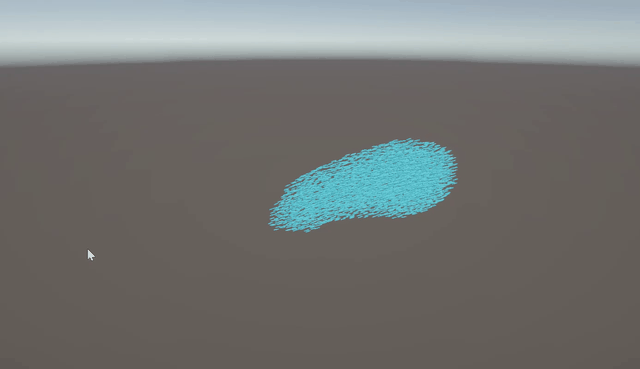

# Unity DOTS Boids Sample

Unity 6 + URP + DOTS で 3D Boids を動かすサンプルです。`Entities Graphics` で描画し、`ISystem + Burst` と 3D 空間ハッシュで flocking を更新します。

## Demo

## Environment

- Unity `6000.4.1f1`
- URP `17.4.0`
- Entities `1.4.3`
- Entities Graphics `1.4.16`
- Input System `1.19.0`

## Features

- 3D 空間内を泳ぐ DOTS Boids
- `NativeParallelMultiHashMap` を使った近傍探索
- `alignment / cohesion / separation / bounds steering`
- 画面左クリックで群れの誘導先を更新
- `BoidsSubScene` を使った baking ベース構成

## Controls

- `Play`: flocking simulation を開始
- `Left Click`: クリックしたあたりへ群れを引き寄せる

## Scene Setup

- Entry scene: `Assets/Scenes/SampleScene.unity`
- SubScene: `Assets/Scenes/BoidsSubScene.unity`
- Main tuning component: `BoidSimulationAuthoring`

## Scripts

- `Assets/Scripts/Boids/BoidSimulationAuthoring.cs`
- `Assets/Scripts/Boids/BoidSpawnSystem.cs`
- `Assets/Scripts/Boids/BoidSpatialHashBuildSystem.cs`
- `Assets/Scripts/Boids/BoidFlockingSystem.cs`
- `Assets/Scripts/Boids/BoidClickTargetController.cs`
